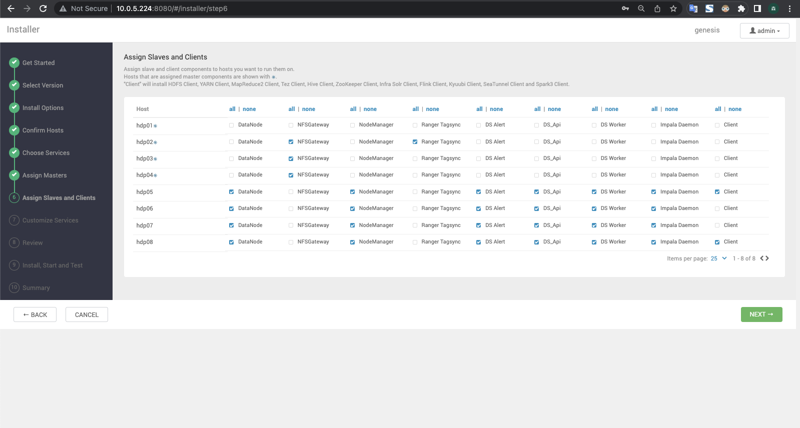

# Ambari && HDP 离线自动化安装

先在一台机器安装 Ambari，然后通过 Ambari Web 界面安装 HDP。

- Ambari 版本: 2.7.6.0-4
- HDP 版本: 3.3.1.0-004
- MySQL 版本: 8.0
- Java 版本: 1.8
- 系统版本: Centos 7* / Rocky 8*

*****

## 前提

1. 从公司云盘下载软件包 ambari-parcels.20230625.tar.gz 到脚本执行机器中。
- http://119.254.145.21:12225/owncloud/index.php/s/B9zMOKVyVB7Bu4z
- 如果网盘链接失效，去网盘目录下找该包：03-大数据/04-HDP/ambari-parcels.20230625.tar.gz
```bash
wget -O /opt/ambari-parcels.20230625.tar.gz http://119.254.145.21:12225/owncloud/index.php/s/B9zMOKVyVB7Bu4z/download
```

2. 把压缩包解压到 /var/www/html 目录下
```bash
mkdir -p /var/www/html
tar -zxvf /opt/ambari-parcels.20230625.tar.gz -C /var/www/html/
```

## 一、Ambari 安装

### 0. 配置环境变量
- 需要手动补充该文件中的配置项
- [./00_env](./00_env)

### 1. 配置集群间ssh免密
- 需要修改 `config/vm_info` 文件
- [./01_sshpass.sh](./01_sshpass.sh)

### 2. 配置所有节点的 hosts
- 需要修改 `config/hosts` 文件
- [./02_hosts.sh](./02_hosts.sh)

### 3. 初始化系统环境
- [./03_init.sh](./03_init.sh)

### 4. 安装/配置 httpd
- [./04_httpd.sh](./04_httpd.sh)

### 5. 安装/配置 java
- [./05_java.sh](./05_java.sh)

### 6. 安装/配置 chrony
- [./06_chrony.sh](./06_chrony.sh)

### 7. 安装/配置 mysql
- [./07_mysql.sh](./07_mysql.sh)

### 8. 安装/配置 ambari agent
- [./08_ambari_agent.sh](./08_ambari_agent.sh)

### 09. 安/配置装 ambari server
- [./09_ambari_server.sh](./09_ambari_server.sh)

### 10. 配置 hdp
- [./10_hdp.sh](./10_hdp.sh)

*****

## 二、HDP 安装
- 
- 
- 
- 
- 
- 
- 
- 
- 
- 

## 三、其它
1. hue 缺少 MySQL-python
```bash
yum install -y mysql-devel

source /usr/hdp/current/hue/build/env/bin/activate
pip uninstall mysqlclient
pip uninstall mysql-python
pip install mysql-python
```

2. ambari-parcels.6.3.1466458.tar.gz
```bash
/var/www/html/ambari-parcels
|-- ambari
|   `-- 2.7.6.0-4
|       |-- ambari
|       |   |-- ambari-agent-2.7.6.0-4.x86_64.rpm
|       |   |-- ambari-infra-manager-2.7.6.0-4.x86_64.rpm
|       |   |-- ambari-infra-solr-2.7.6.0-4.x86_64.rpm
|       |   |-- ambari-infra-solr-client-2.7.6.0-4.x86_64.rpm
|       |   |-- ambari-logsearch-logfeeder-2.7.6.0-4.x86_64.rpm
|       |   |-- ambari-logsearch-portal-2.7.6.0-4.x86_64.rpm
|       |   |-- ambari-metrics-collector-2.7.6.0-4.x86_64.rpm
|       |   |-- ambari-metrics-common-2.7.6.0-4.noarch.rpm
|       |   |-- ambari-metrics-grafana-2.7.6.0-4.x86_64.rpm
|       |   |-- ambari-metrics-hadoop-sink-2.7.6.0-4.x86_64.rpm
|       |   |-- ambari-metrics-monitor-2.7.6.0-4.x86_64.rpm
|       |   `-- ambari-server-2.7.6.0-4.x86_64.rpm
|       |-- ambari.repo
|       |-- repodata
|       |   |-- 18dac4d4a3da2c07f7ade3c6d52941beab5326e6f2a17328d9cac4b2835ead86-primary.sqlite.bz2
|       |   |-- 341fd9de6b933430aadd9b0621539114d57871f7faff571acd0d5a852abe2123-filelists.sqlite.bz2
|       |   |-- 4f35cebfb8f074d3ae636d48e6f100125967b7471d38f96a65cb2a61b960872e-other.xml.gz
|       |   |-- 62ec77f9b8de408c99671d3e27d19a0ed595c8c3d3d1128f189cd95eac1d5917-other.sqlite.bz2
|       |   |-- d633468afdfb14b4aec6587dc14dbb33a511156cbbb7e4b13d2ec41eaefa4a2c-filelists.xml.gz
|       |   |-- db2638d99c49fce686c0863f5288f9747b5cad28322cf690fded50a659df112b-primary.xml.gz
|       |   `-- repomd.xml
|       `-- RPM-GPG-KEY
|           `-- RPM-GPG-KEY-Jenkins
|-- hdp
|   `-- 3.3.1.0-004
|       |-- atlas-metadata
|       |   |-- atlas-metadata_3_3_1_0_004-2.2.0.3.3.1.0-004.x86_64.rpm
|       |   |-- atlas-metadata_3_3_1_0_004-hbase-plugin-2.2.0.3.3.1.0-004.x86_64.rpm
|       |   |-- atlas-metadata_3_3_1_0_004-hive-plugin-2.2.0.3.3.1.0-004.x86_64.rpm
|       |   |-- atlas-metadata_3_3_1_0_004-kafka-plugin-2.2.0.3.3.1.0-004.x86_64.rpm
|       |   |-- atlas-metadata_3_3_1_0_004-sqoop-plugin-2.2.0.3.3.1.0-004.x86_64.rpm
|       |   `-- atlas-metadata_3_3_1_0_004-storm-plugin-2.2.0.3.3.1.0-004.x86_64.rpm
|       |-- bigtop-jsvc
|       |   `-- bigtop-jsvc-1.0.15-004.x86_64.rpm
|       |-- dolphinscheduler
|       |   `-- dolphinscheduler_3_3_1_0_004-3.1.7.3.3.1.0-004.x86_64.rpm
|       |-- doris
|       |   |-- doris_3_3_1_0_004-be-1.2.4.1.3.3.1.0-004.x86_64.rpm
|       |   |-- doris_3_3_1_0_004-client-1.2.4.1.3.3.1.0-004.x86_64.rpm
|       |   |-- doris_3_3_1_0_004-fe-1.2.4.1.3.3.1.0-004.x86_64.rpm
|       |   `-- doris_3_3_1_0_004-hdfs_broker-1.2.4.1.3.3.1.0-004.x86_64.rpm
|       |-- flink
|       |   `-- flink_3_3_1_0_004-1.15.2.3.3.1.0-004.x86_64.rpm
|       |-- hadoop
|       |   |-- hadoop_3_3_1_0_004-3.3.4.3.3.1.0-004.x86_64.rpm
|       |   |-- hadoop_3_3_1_0_004-client-3.3.4.3.3.1.0-004.x86_64.rpm
|       |   |-- hadoop_3_3_1_0_004-hdfs-3.3.4.3.3.1.0-004.x86_64.rpm
|       |   |-- hadoop_3_3_1_0_004-hdfs-datanode-3.3.4.3.3.1.0-004.x86_64.rpm
|       |   |-- hadoop_3_3_1_0_004-hdfs-fuse-3.3.4.3.3.1.0-004.x86_64.rpm
|       |   |-- hadoop_3_3_1_0_004-hdfs-journalnode-3.3.4.3.3.1.0-004.x86_64.rpm
|       |   |-- hadoop_3_3_1_0_004-hdfs-namenode-3.3.4.3.3.1.0-004.x86_64.rpm
|       |   |-- hadoop_3_3_1_0_004-hdfs-secondarynamenode-3.3.4.3.3.1.0-004.x86_64.rpm
|       |   |-- hadoop_3_3_1_0_004-hdfs-zkfc-3.3.4.3.3.1.0-004.x86_64.rpm
|       |   |-- hadoop_3_3_1_0_004-httpfs-3.3.4.3.3.1.0-004.x86_64.rpm
|       |   |-- hadoop_3_3_1_0_004-httpfs-server-3.3.4.3.3.1.0-004.x86_64.rpm
|       |   |-- hadoop_3_3_1_0_004-libhdfs-3.3.4.3.3.1.0-004.x86_64.rpm
|       |   |-- hadoop_3_3_1_0_004-mapreduce-3.3.4.3.3.1.0-004.x86_64.rpm
|       |   |-- hadoop_3_3_1_0_004-mapreduce-historyserver-3.3.4.3.3.1.0-004.x86_64.rpm
|       |   |-- hadoop_3_3_1_0_004-yarn-3.3.4.3.3.1.0-004.x86_64.rpm
|       |   |-- hadoop_3_3_1_0_004-yarn-nodemanager-3.3.4.3.3.1.0-004.x86_64.rpm
|       |   |-- hadoop_3_3_1_0_004-yarn-proxyserver-3.3.4.3.3.1.0-004.x86_64.rpm
|       |   |-- hadoop_3_3_1_0_004-yarn-registrydns-3.3.4.3.3.1.0-004.x86_64.rpm
|       |   |-- hadoop_3_3_1_0_004-yarn-resourcemanager-3.3.4.3.3.1.0-004.x86_64.rpm
|       |   |-- hadoop_3_3_1_0_004-yarn-timelinereader-3.3.4.3.3.1.0-004.x86_64.rpm
|       |   `-- hadoop_3_3_1_0_004-yarn-timelineserver-3.3.4.3.3.1.0-004.x86_64.rpm
|       |-- hbase
|       |   |-- hbase_3_3_1_0_004-2.4.14.3.3.1.0-004.x86_64.rpm
|       |   |-- hbase_3_3_1_0_004-doc-2.4.14.3.3.1.0-004.x86_64.rpm
|       |   |-- hbase_3_3_1_0_004-master-2.4.14.3.3.1.0-004.x86_64.rpm
|       |   |-- hbase_3_3_1_0_004-regionserver-2.4.14.3.3.1.0-004.x86_64.rpm
|       |   |-- hbase_3_3_1_0_004-rest-2.4.14.3.3.1.0-004.x86_64.rpm
|       |   |-- hbase_3_3_1_0_004-thrift2-2.4.14.3.3.1.0-004.x86_64.rpm
|       |   `-- hbase_3_3_1_0_004-thrift-2.4.14.3.3.1.0-004.x86_64.rpm
|       |-- HDP-3.3.1.0-004-PATCH.xml
|       |-- HDP-3.3.1.0-004.xml
|       |-- hdp.repo
|       |-- hdp-select
|       |   `-- hdp-select-3.3.1.0-004.x86_64.rpm
|       |-- hive
|       |   |-- hive_3_3_1_0_004-3.1.3.3.3.1.0-004.x86_64.rpm
|       |   |-- hive_3_3_1_0_004-hcatalog-3.1.3.3.3.1.0-004.x86_64.rpm
|       |   |-- hive_3_3_1_0_004-hcatalog-server-3.1.3.3.3.1.0-004.x86_64.rpm
|       |   |-- hive_3_3_1_0_004-jdbc-3.1.3.3.3.1.0-004.x86_64.rpm
|       |   |-- hive_3_3_1_0_004-metastore-3.1.3.3.3.1.0-004.x86_64.rpm
|       |   |-- hive_3_3_1_0_004-server2-3.1.3.3.3.1.0-004.x86_64.rpm
|       |   |-- hive_3_3_1_0_004-server-3.1.3.3.3.1.0-004.x86_64.rpm
|       |   |-- hive_3_3_1_0_004-webhcat-3.1.3.3.3.1.0-004.x86_64.rpm
|       |   `-- hive_3_3_1_0_004-webhcat-server-3.1.3.3.3.1.0-004.x86_64.rpm
|       |-- hue
|       |   `-- hue_3_3_1_0_004-4.11.0.3.3.1.0-004.x86_64.rpm
|       |-- impala
|       |   |-- impala_3_3_1_0_004-4.1.2.3.3.1.0-004.x86_64.rpm
|       |   `-- impala_3_3_1_0_004-shell-4.1.2.3.3.1.0-004.x86_64.rpm
|       |-- kafka
|       |   `-- kafka_3_3_1_0_004-2.8.2.3.3.1.0-004.x86_64.rpm
|       |-- knox
|       |   `-- knox_3_3_1_0_004-1.6.1.3.3.1.0-004.x86_64.rpm
|       |-- kudu
|       |   `-- kudu_3_3_1_0_004-1.16.0.3.3.1.0-004.x86_64.rpm
|       |-- kyuubi
|       |   `-- kyuubi_3_3_1_0_004-1.6.1.3.3.1.0-004.x86_64.rpm
|       |-- livy2
|       |   `-- livy2_3_3_1_0_004-0.8.0.3.3.1.0-004.x86_64.rpm
|       |-- ozone
|       |   `-- ozone_3_3_1_0_004-1.3.0.3.3.1.0-004.x86_64.rpm
|       |-- phoenix
|       |   `-- phoenix_3_3_1_0_004-5.1.2.3.3.1.0-004.x86_64.rpm
|       |-- ranger
|       |   |-- ranger_3_3_1_0_004-admin-2.3.0.3.3.1.0-004.x86_64.rpm
|       |   |-- ranger_3_3_1_0_004-atlas-plugin-2.3.0.3.3.1.0-004.x86_64.rpm
|       |   |-- ranger_3_3_1_0_004-hbase-plugin-2.3.0.3.3.1.0-004.x86_64.rpm
|       |   |-- ranger_3_3_1_0_004-hdfs-plugin-2.3.0.3.3.1.0-004.x86_64.rpm
|       |   |-- ranger_3_3_1_0_004-hive-plugin-2.3.0.3.3.1.0-004.x86_64.rpm
|       |   |-- ranger_3_3_1_0_004-kafka-plugin-2.3.0.3.3.1.0-004.x86_64.rpm
|       |   |-- ranger_3_3_1_0_004-kms-2.3.0.3.3.1.0-004.x86_64.rpm
|       |   |-- ranger_3_3_1_0_004-knox-plugin-2.3.0.3.3.1.0-004.x86_64.rpm
|       |   |-- ranger_3_3_1_0_004-ozone-plugin-2.3.0.3.3.1.0-004.x86_64.rpm
|       |   |-- ranger_3_3_1_0_004-solr-plugin-2.3.0.3.3.1.0-004.x86_64.rpm
|       |   |-- ranger_3_3_1_0_004-spark3-plugin-2.3.0.3.3.1.0-004.x86_64.rpm
|       |   |-- ranger_3_3_1_0_004-storm-plugin-2.3.0.3.3.1.0-004.x86_64.rpm
|       |   |-- ranger_3_3_1_0_004-tagsync-2.3.0.3.3.1.0-004.x86_64.rpm
|       |   |-- ranger_3_3_1_0_004-usersync-2.3.0.3.3.1.0-004.x86_64.rpm
|       |   `-- ranger_3_3_1_0_004-yarn-plugin-2.3.0.3.3.1.0-004.x86_64.rpm
|       |-- repodata
|       |   |-- 113724235101ab0a5ec53dffb9ef2bca5559b4ffb3814ff589eb8d8b5afb35eb-filelists.xml.gz
|       |   |-- 36bd264b315e4fee82a41e1e6197740a577020c61f807816d3871bf8279193eb-other.xml.gz
|       |   |-- 6fdac8b589ad586c766b5dfa3fd5da3d52f5d6ce1c43ae58711cd82fa6de2420-primary.sqlite.bz2
|       |   |-- c9b7869b0f18ffa94a6ab3b62f53dd597104eb779f4986bc96bfe7cbebc2b876-primary.xml.gz
|       |   |-- f4c1e568f4414ae03b51649ca1b84a5ad68a582bf803874723d827648579a975-other.sqlite.bz2
|       |   |-- fba8fc35baaf09f28b36326a847e75ac03cd6f0caf796c24bf7ee72910646d12-filelists.sqlite.bz2
|       |   `-- repomd.xml
|       |-- RPM-GPG-KEY
|       |   `-- RPM-GPG-KEY-Jenkins
|       |-- seatunnel
|       |   `-- seatunnel_3_3_1_0_004-2.3.1.3.3.1.0-004.x86_64.rpm
|       |-- spark2
|       |   |-- spark2_3_3_1_0_004-2.4.8.3.3.1.0-004.x86_64.rpm
|       |   |-- spark2_3_3_1_0_004-master-2.4.8.3.3.1.0-004.x86_64.rpm
|       |   |-- spark2_3_3_1_0_004-python-2.4.8.3.3.1.0-004.x86_64.rpm
|       |   |-- spark2_3_3_1_0_004-worker-2.4.8.3.3.1.0-004.x86_64.rpm
|       |   `-- spark2_3_3_1_0_004-yarn-shuffle-2.4.8.3.3.1.0-004.x86_64.rpm
|       |-- spark3
|       |   |-- spark3_3_3_1_0_004-3.3.2.3.3.1.0-004.x86_64.rpm
|       |   |-- spark3_3_3_1_0_004-master-3.3.2.3.3.1.0-004.x86_64.rpm
|       |   |-- spark3_3_3_1_0_004-python-3.3.2.3.3.1.0-004.x86_64.rpm
|       |   |-- spark3_3_3_1_0_004-worker-3.3.2.3.3.1.0-004.x86_64.rpm
|       |   `-- spark3_3_3_1_0_004-yarn-shuffle-3.3.2.3.3.1.0-004.x86_64.rpm
|       |-- spark-atlas-connector
|       |   `-- spark-atlas-connector_3_3_1_0_004-0.1.0.3.3.1.0-004.x86_64.rpm
|       |-- sqoop
|       |   |-- sqoop_3_3_1_0_004-1.4.7.3.3.1.0-004.x86_64.rpm
|       |   `-- sqoop_3_3_1_0_004-metastore-1.4.7.3.3.1.0-004.x86_64.rpm
|       |-- tez
|       |   `-- tez_3_3_1_0_004-0.10.2.3.3.1.0-004.x86_64.rpm
|       `-- zookeeper
|           |-- zookeeper_3_3_1_0_004-3.7.1.3.3.1.0-004.x86_64.rpm
|           `-- zookeeper_3_3_1_0_004-server-3.7.1.3.3.1.0-004.x86_64.rpm
|-- hdp-utils
|   `-- 1.1.0.22
|       |-- hdp-utils.repo
|       |-- openblas
|       |   |-- openblas-0.2.19-4.el7.x86_64.rpm
|       |   |-- openblas-devel-0.2.19-4.el7.x86_64.rpm
|       |   |-- openblas-openmp-0.2.19-4.el7.x86_64.rpm
|       |   |-- openblas-openmp64_-0.2.19-4.el7.x86_64.rpm
|       |   |-- openblas-openmp64-0.2.19-4.el7.x86_64.rpm
|       |   |-- openblas-Rblas-0.2.19-4.el7.x86_64.rpm
|       |   |-- openblas-serial64_-0.2.19-4.el7.x86_64.rpm
|       |   |-- openblas-serial64-0.2.19-4.el7.x86_64.rpm
|       |   |-- openblas-static-0.2.19-4.el7.x86_64.rpm
|       |   |-- openblas-threads-0.2.19-4.el7.x86_64.rpm
|       |   |-- openblas-threads64_-0.2.19-4.el7.x86_64.rpm
|       |   `-- openblas-threads64-0.2.19-4.el7.x86_64.rpm
|       |-- repodata
|       |   |-- 03caa5dc00c5e38c9d3a33abe86589986f1efb825d982b73dd377889fc70ae2b-filelists.sqlite.bz2
|       |   |-- 392f74ff6f3c9e0e8ef0b933efd5f9d5b08977dd3396772336ee7d71051d460a-filelists.xml.gz
|       |   |-- 395136b97d8b1d5ec9cc5c77ff7de68568d3865675840b3305f6aa42796ac663-other.sqlite.bz2
|       |   |-- 5e1eca162a63e4ea0ecf2bf7cdc394ad97f8ec9966810f18b764e98c3f8bc6e0-primary.xml.gz
|       |   |-- b129db4961099c4fee5efb06e88f9918f2087e524b14de83925efc376027fe36-primary.sqlite.bz2
|       |   |-- b4f6be336c4deaf2eddd958c6dab1d975d6b0274f2b336e58f9075190cc09a5f-other.xml.gz
|       |   `-- repomd.xml
|       |-- RPM-GPG-KEY
|       |   `-- RPM-GPG-KEY-Jenkins
|       `-- snappy
|           |-- snappy-1.1.0-3.el7.i686.rpm
|           |-- snappy-1.1.0-3.el7.x86_64.rpm
|           |-- snappy-devel-1.1.0-3.el7.i686.rpm
|           `-- snappy-devel-1.1.0-3.el7.x86_64.rpm
`-- others
    |-- iceberg-flink-runtime-1.15-1.3.0.jar
    |-- iceberg-hive-runtime-1.3.0.jar
    |-- iceberg-spark-runtime-3.3_2.12-1.3.0.jar
    |-- jdk-8u202-linux-x64.tar.gz
    |-- libfb303-0.9.3.jar
    |-- mysql-8.0-el7-bundle-rpms.tar.gz
    `-- mysql-8.0-el8-bundle-rpms.tar.gz

42 directories, 157 files
```

## 四、Refs
1. HDP3.3.1.0-004版本: https://mp.weixin.qq.com/s/FrktFj2qgjsldxHlRgszDg
2. Ambari-2.7.6和HDP-3.3.1安装: http://mp.weixin.qq.com/s?__biz=MzkwODM4NTc4Mw==&mid=2247483799&idx=2&sn=0152829912f367e40aff1d9867ae8f19&chksm=c0cb8d0ff7bc0419bad2649b7d682b43acf0e86e19bb064e92fbda46412ff309a1e8ae7294c2&scene=21#wechat_redirect
3. HDP3.3.1 安装指南（1）: http://mp.weixin.qq.com/s?__biz=MzkwODM4NTc4Mw==&mid=2247483867&idx=1&sn=0270ea5e84002fa42fa5f541380808f3&chksm=c0cb8d43f7bc045503870fbe3114661924f3954c219cc3f018ce7c12af6f21c856efd7f55097&scene=21#wechat_redirect
4. Centos7/8 RPMS: https://centos.pkgs.org/
